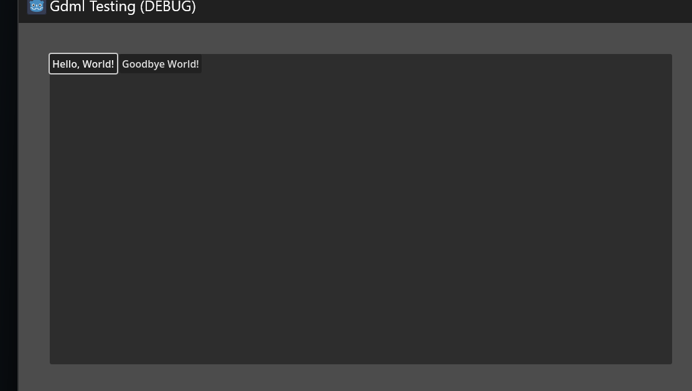

XML Markup Language for Godot UI
================================

This is a work in progress to bring an XML driven node structure for scene creation.
As the title suggests, this is starting with control nodes only for simplicity.

You can create any control element with the basic properties (see issues).

Issues:
- Not all property types are supports yet, only scalar, enums and a few variant types
- You cannot yet create your own derived tags, but this may be supported when turning the project into a source generator.

Example
-------

### Nxml

	<?xml version="1.0" encoding="UTF-8"?>
	<PanelContainer xmlns="http://archwyvern.com/xsd/Nxml"
					Position="50,50"
					Size="1000,500">
		<HFlowContainer>
			<Button Text="Hello, World!" />
			<Button Text="Goodbye World!" />
		</HFlowContainer>
	</PanelContainer>

### Output

Project Structure
-----------------

- Archwyvern.Project - A godot project for testing.
- Archwyvern.Nxml.Generate - Nearly all source files are auto generated by this project
- Archwyvern.Nxml - The generated source files are primary integration library.