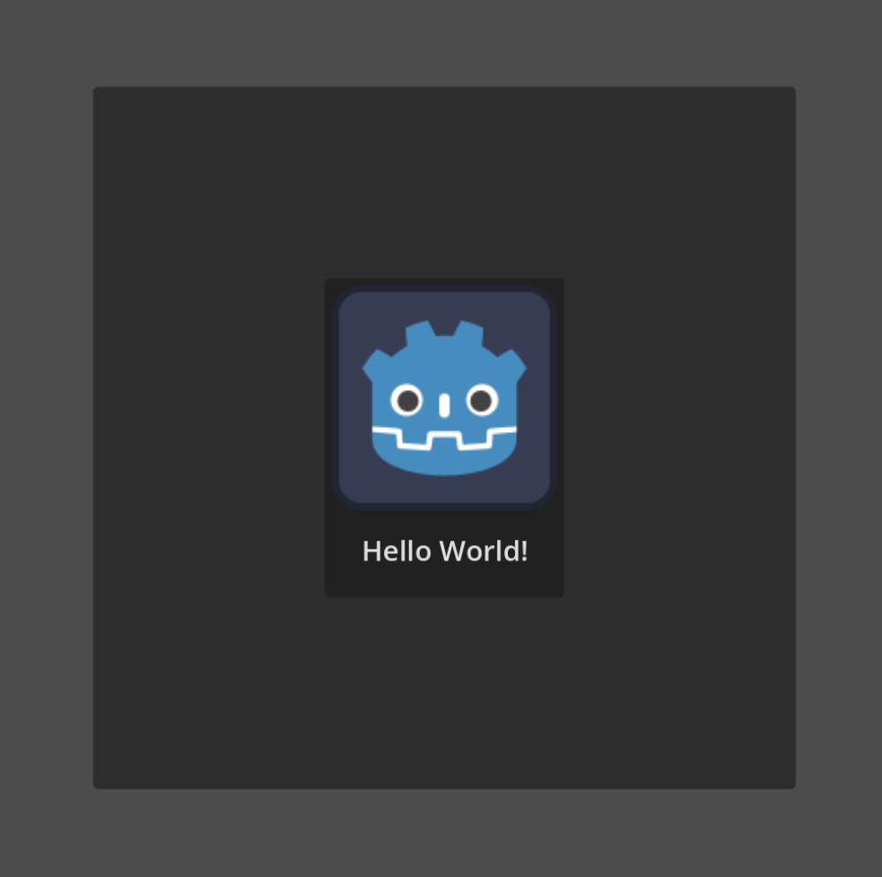

XML Markup Language for Godot Objects
=====================================

This is a work in progress to bring an XML driven node structure for scene creation.
As the title suggests, this is starting with control nodes only for simplicity.

You can create any control element with the basic properties (see issues).

Issues:
- Not all property types are supports yet, only scalar, enums, resources and a few variant types
- You cannot yet create your own derived tags, but this may be supported when turning the project into a source generator.

Example
-------

### Xml
```xml
<NodeLayout xmlns="http://archwyvern.com/xsd/nxml">
    <PanelContainer Position="200,200" Size="400,400">
        <CenterContainer>
            <Button Alignment="Center" IconAlignment="Center" VerticalIconAlignment="Top">
                <Button.Text>Hello World!</Button.Text>
                <Button.Icon>
                    <CompressedTexture2D ResourcePath="res://icon.svg" />
                </Button.Icon>
            </Button>
        </CenterContainer>
    </PanelContainer>
</NodeLayout>
```

### C#

```csharp
using Archwyvern.Nxml;
using Godot;

namespace Archwyvern.Project;

public partial class Main : Node2D
{
    private SerializationManager.Initializer _initializer;

    public override void _Ready()
    {
        // The serializer takes a while to build, but runs in the background.
        // Once built, it doesn't need to do so again.
        SerializationManager.Initialize(LoadUI);
    }

    private void LoadUI(double loadTime) // or just LoadUI()
    {
        //GD.Print("Serializer assembly time: " + loadTime); // ~1.95

        // Load your XML file and get the node layout from the serialization manager.
        // This process may soon include a custom resource to load with GD.Load<XNodeLayout>();

        var file = Godot.FileAccess.Open("res://data/Hud.nxml", Godot.FileAccess.ModeFlags.Read);
        
        //double deserializeTime = Time.GetUnixTimeFromSystem();

        // The layout is a populated DTO containing all the raw data needed to create a node.
        // If you need to reuse a layout, you will need to store it to a field, again though this may be handled later with a resource.
        var layout = SerializationManager.GetNodeLayout(file.GetAsText());

        //GD.Print("deserialization time: " + (Time.GetUnixTimeFromSystem() - deserializeTime)); // ~0.165
        //double generateTime = Time.GetUnixTimeFromSystem();

        // Create the node from the layout
        var node = layout.Generate();

        //GD.Print("Node generation time: " + (Time.GetUnixTimeFromSystem() - generateTime)); // ~0.008

        AddChild(node);
    }
}
```

### Game



Project Structure
-----------------

- Archwyvern.Project - A godot project for testing.
- Archwyvern.Nxml.Generate - Nearly all source files are auto generated by this project
- Archwyvern.Nxml - The generated source files are primary integration library.